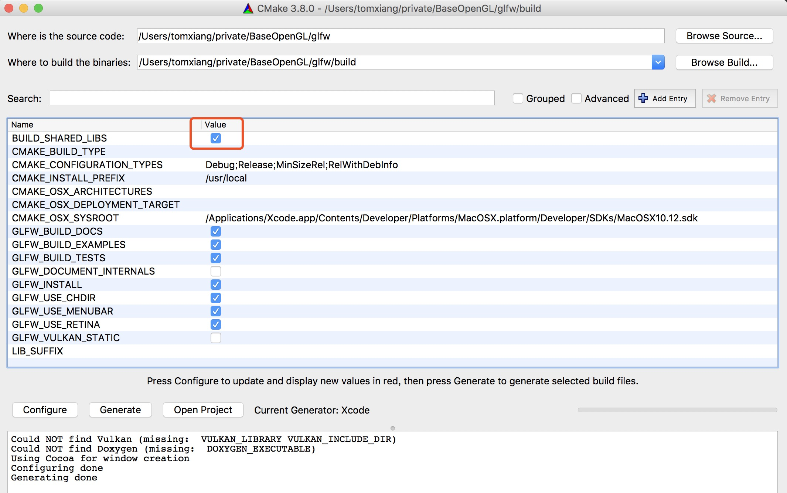
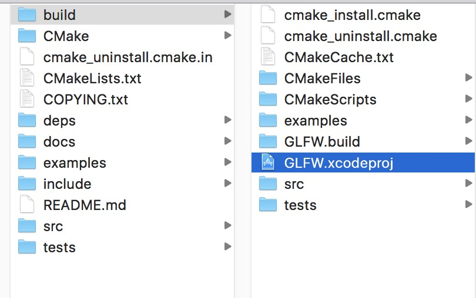
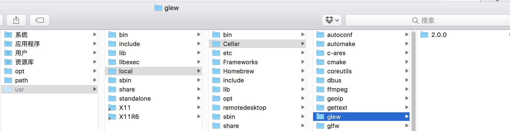
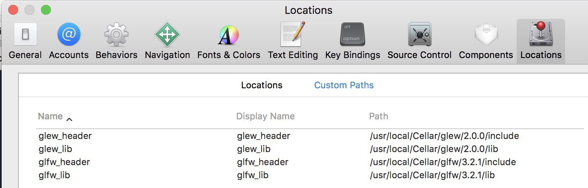
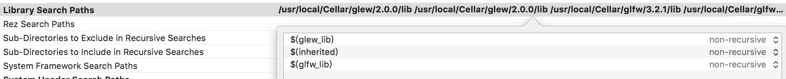
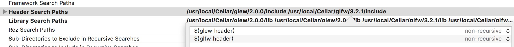
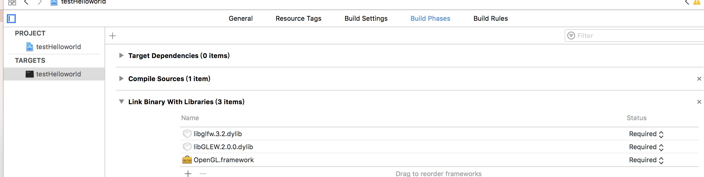
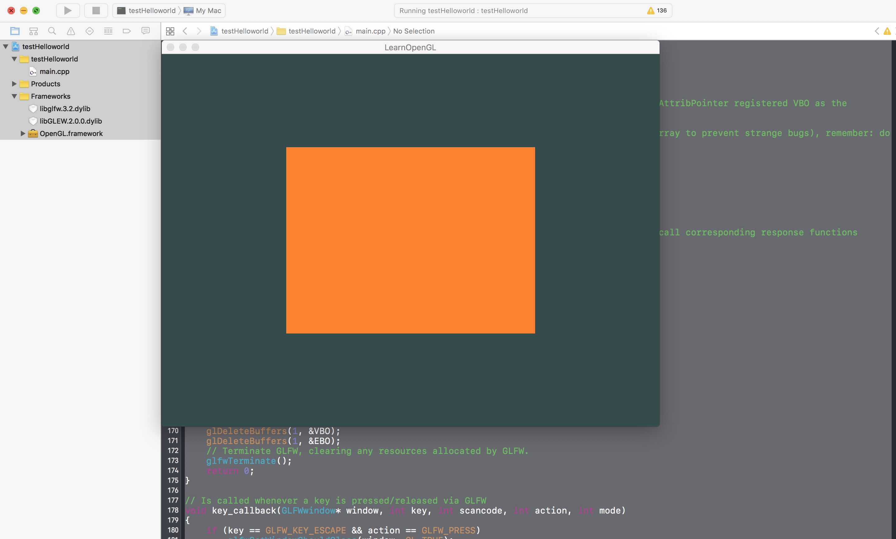

###Mac下Xcode+OpenGL环境搭建

####一. 所需工具

#####1. GLFW  
一个轻量级的，开源的，跨平台的library。支持OpenGL及OpenGL ES，用来管理窗口，读取输入，处理事件等。因为OpenGL没有窗口管理的功能，所以很多热心的人写了工具来支持这些功能，比如早期的glut，现在的freeglut等。那么GLFW有何优势呢？glut太老了，最后一个版本还是90年代的。freeglut完全兼容glut，算是glut的代替品，功能齐全，但是bug太多。稳定性也不好（不是我说的啊），GLFW应运而生。  

#####2. GLEW   
GLEW是一个跨平台的C++扩展库，基于OpenGL图形接口。使用OpenGL的朋友都知道，window目前只支持OpenGL1.1的涵数，但 OpenGL现在都发展到2.0以上了，要使用这些OpenGL的高级特性，就必须下载最新的扩展，另外，不同的显卡公司，也会发布一些只有自家显卡才支 持的扩展函数，你要想用这数涵数，不得不去寻找最新的glext.h,有了GLEW扩展库，你就再也不用为找不到函数的接口而烦恼，因为GLEW能自动识 别你的平台所支持的全部OpenGL高级扩展涵数。也就是说，只要包含一个glew.h头文件，你就能使用gl,glu,glext,wgl,glx的全 部函数。GLEW支持目前流行的各种操作系统（including Windows, Linux, Mac OS X, FreeBSD, Irix, and Solaris）。

####二. 查看源码
#####1. 下载cmake的IDE工具
[cmake](https://cmake.org/download/)

#####2. 下载GLFW和GLEW的源码
GLEW的git下载地址:[GLEW download](http://glew.sourceforge.net/)  
GLFW的下载地址:[GLFW download](http://www.glfw.org/)

#####3. 源码查看
打开cmake的IDE，然后按照下图的配置
. 
generate成功之后我们可以看到目录下有了xcode工程,可以打开编译成功了   
.   

####三. 具体操作
#####1.安装glew和glfw3

```objc
$ brew install glew
$ brew install homebrew/versions/glfw3
```
完了之后，进入/usr/local/Cellar查看是否有glew和glfw。
. 

#####2. 告诉 xcode 如何去加载这些库
安装完成后在Xcode的 Proferences > Locations > Source Trees 中添加刚才安装的GLFW, GLEW的库文件, 通过 brew 安装的库通常放在 /usr/local/Cellar, 然后找相应的 include, lib 路径进行配置   

. 

#####3. xcode配置
**1.到 build Setting -> Header Search Path 和 Library Search Path 添加相应的配置 , 以下是我的配置.**  

```objc
// header search patch 
$(glew_header)
$(glfw_header)
// library search path
$(glew_lib)
$(glfw_lib)  
```
也可以复制如下的代码去   

```objc 
$(glew_header) $(glfw_header)    
$(inherited) $(glew_lib) $(glfw_lib) 
```  

 



**2.BuiledPhases下增加**.  
  
这两个库就是之前brew的库，路径是   

```objc
/usr/local/Cellar/glew/2.0.0/lib/
/usr/local/Cellar/glfw/3.2.1/lib/
```


#####4. 代码测试
```objc
#include <iostream>

// GLEW
#define GLEW_STATIC
#include <GL/glew.h>

// GLFW
#include <GLFW/glfw3.h>


// Function prototypes
void key_callback(GLFWwindow* window, int key, int scancode, int action, int mode);

// Window dimensions
const GLuint WIDTH = 800, HEIGHT = 600;

// Shaders
const GLchar* vertexShaderSource = "#version 330 core\n"
"layout (location = 0) in vec3 position;\n"
"void main()\n"
"{\n"
"gl_Position = vec4(position.x, position.y, position.z, 1.0);\n"
"}\0";
const GLchar* fragmentShaderSource = "#version 330 core\n"
"out vec4 color;\n"
"void main()\n"
"{\n"
"color = vec4(1.0f, 0.5f, 0.2f, 1.0f);\n"
"}\n\0";

// The MAIN function, from here we start the application and run the game loop
int main()
{
    std::cout << "Starting GLFW context, OpenGL 3.3" << std::endl;
    // Init GLFW
    glfwInit();
    // Set all the required options for GLFW
    glfwWindowHint(GLFW_CONTEXT_VERSION_MAJOR, 4);
    glfwWindowHint(GLFW_CONTEXT_VERSION_MINOR, 1);
    glfwWindowHint(GLFW_OPENGL_PROFILE, GLFW_OPENGL_CORE_PROFILE);
    glfwWindowHint(GLFW_OPENGL_FORWARD_COMPAT, GL_TRUE);
    glfwWindowHint(GLFW_RESIZABLE, GL_FALSE);
    
    // Create a GLFWwindow object that we can use for GLFW's functions
    GLFWwindow* window = glfwCreateWindow(WIDTH, HEIGHT, "LearnOpenGL", nullptr, nullptr);
    glfwMakeContextCurrent(window);
    
    // Set the required callback functions
    glfwSetKeyCallback(window, key_callback);
    
    // Set this to true so GLEW knows to use a modern approach to retrieving function pointers and extensions
    glewExperimental = GL_TRUE;
    // Initialize GLEW to setup the OpenGL Function pointers
    glewInit();
    
    // Define the viewport dimensions
    int width, height;
    glfwGetFramebufferSize(window, &width, &height);
    glViewport(0, 0, width, height);
    
    
    // Build and compile our shader program
    // Vertex shader
    GLint vertexShader = glCreateShader(GL_VERTEX_SHADER);
    glShaderSource(vertexShader, 1, &vertexShaderSource, NULL);
    glCompileShader(vertexShader);
    // Check for compile time errors
    GLint success;
    GLchar infoLog[512];
    glGetShaderiv(vertexShader, GL_COMPILE_STATUS, &success);
    if (!success)
    {
        glGetShaderInfoLog(vertexShader, 512, NULL, infoLog);
        std::cout << "ERROR::SHADER::VERTEX::COMPILATION_FAILED\n" << infoLog << std::endl;
    }
    // Fragment shader
    GLint fragmentShader = glCreateShader(GL_FRAGMENT_SHADER);
    glShaderSource(fragmentShader, 1, &fragmentShaderSource, NULL);
    glCompileShader(fragmentShader);
    // Check for compile time errors
    glGetShaderiv(fragmentShader, GL_COMPILE_STATUS, &success);
    if (!success)
    {
        glGetShaderInfoLog(fragmentShader, 512, NULL, infoLog);
        std::cout << "ERROR::SHADER::FRAGMENT::COMPILATION_FAILED\n" << infoLog << std::endl;
    }
    // Link shaders
    GLint shaderProgram = glCreateProgram();
    glAttachShader(shaderProgram, vertexShader);
    glAttachShader(shaderProgram, fragmentShader);
    glLinkProgram(shaderProgram);
    // Check for linking errors
    glGetProgramiv(shaderProgram, GL_LINK_STATUS, &success);
    if (!success) {
        glGetProgramInfoLog(shaderProgram, 512, NULL, infoLog);
        std::cout << "ERROR::SHADER::PROGRAM::LINKING_FAILED\n" << infoLog << std::endl;
    }
    glDeleteShader(vertexShader);
    glDeleteShader(fragmentShader);
    
    
    // Set up vertex data (and buffer(s)) and attribute pointers
    //GLfloat vertices[] = {
    //  // First triangle
    //   0.5f,  0.5f,  // Top Right
    //   0.5f, -0.5f,  // Bottom Right
    //  -0.5f,  0.5f,  // Top Left
    //  // Second triangle
    //   0.5f, -0.5f,  // Bottom Right
    //  -0.5f, -0.5f,  // Bottom Left
    //  -0.5f,  0.5f   // Top Left
    //};
    GLfloat vertices[] = {
        0.5f,  0.5f, 0.0f,  // Top Right
        0.5f, -0.5f, 0.0f,  // Bottom Right
        -0.5f, -0.5f, 0.0f,  // Bottom Left
        -0.5f,  0.5f, 0.0f   // Top Left
    };
    GLuint indices[] = {  // Note that we start from 0!
        0, 1, 3,  // First Triangle
        1, 2, 3   // Second Triangle
    };
    GLuint VBO, VAO, EBO;
    glGenVertexArrays(1, &VAO);
    glGenBuffers(1, &VBO);
    glGenBuffers(1, &EBO);
    // Bind the Vertex Array Object first, then bind and set vertex buffer(s) and attribute pointer(s).
    glBindVertexArray(VAO);
    
    glBindBuffer(GL_ARRAY_BUFFER, VBO);
    glBufferData(GL_ARRAY_BUFFER, sizeof(vertices), vertices, GL_STATIC_DRAW);
    
    glBindBuffer(GL_ELEMENT_ARRAY_BUFFER, EBO);
    glBufferData(GL_ELEMENT_ARRAY_BUFFER, sizeof(indices), indices, GL_STATIC_DRAW);
    
    glVertexAttribPointer(0, 3, GL_FLOAT, GL_FALSE, 3 * sizeof(GLfloat), (GLvoid*)0);
    glEnableVertexAttribArray(0);
    
    glBindBuffer(GL_ARRAY_BUFFER, 0); // Note that this is allowed, the call to glVertexAttribPointer registered VBO as the currently bound vertex buffer object so afterwards we can safely unbind
    
    glBindVertexArray(0); // Unbind VAO (it's always a good thing to unbind any buffer/array to prevent strange bugs), remember: do NOT unbind the EBO, keep it bound to this VAO
    
    
    // Uncommenting this call will result in wireframe polygons.
    //glPolygonMode(GL_FRONT_AND_BACK, GL_LINE);
    
    // Game loop
    while (!glfwWindowShouldClose(window))
    {
        // Check if any events have been activiated (key pressed, mouse moved etc.) and call corresponding response functions
        glfwPollEvents();
        
        // Render
        // Clear the colorbuffer
        glClearColor(0.2f, 0.3f, 0.3f, 1.0f);
        glClear(GL_COLOR_BUFFER_BIT);
        
        // Draw our first triangle
        glUseProgram(shaderProgram);
        glBindVertexArray(VAO);
        //glDrawArrays(GL_TRIANGLES, 0, 6);
        glDrawElements(GL_TRIANGLES, 6, GL_UNSIGNED_INT, 0);
        glBindVertexArray(0);
        
        // Swap the screen buffers
        glfwSwapBuffers(window);
    }
    // Properly de-allocate all resources once they've outlived their purpose
    glDeleteVertexArrays(1, &VAO);
    glDeleteBuffers(1, &VBO);
    glDeleteBuffers(1, &EBO);
    // Terminate GLFW, clearing any resources allocated by GLFW.
    glfwTerminate();
    return 0;
}

// Is called whenever a key is pressed/released via GLFW
void key_callback(GLFWwindow* window, int key, int scancode, int action, int mode)
{
    if (key == GLFW_KEY_ESCAPE && action == GLFW_PRESS)
        glfwSetWindowShouldClose(window, GL_TRUE);
}
```   

如果出现   

   
表示你已经成功了！ 

### 参考链接：
1.[glew](http://glew.sourceforge.net/)  
2.[glfw](http://www.glfw.org/download.html)   
3.[视频教学](https://www.youtube.com/watch?v=lTmM3Y8SMOM)   
4.[安装配置文件](http://www.jianshu.com/p/e753b36f79c3)  
5.[图文讲解](http://seaneshbaugh.com/posts/creating-an-opengl-4-1-program-with-glew-and-glfw-in-xcode)  