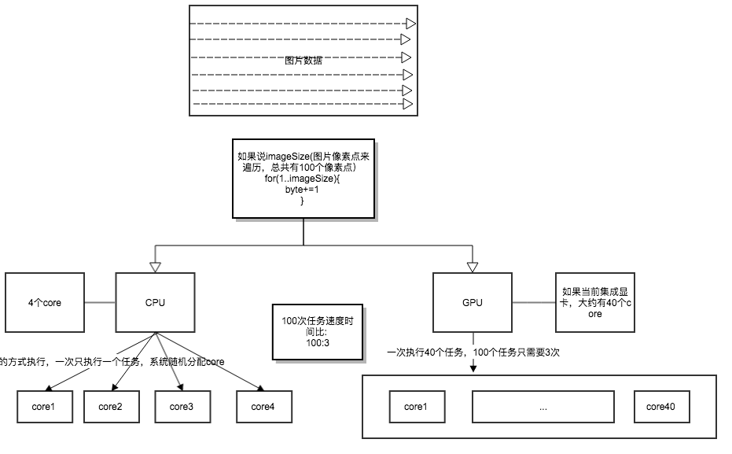
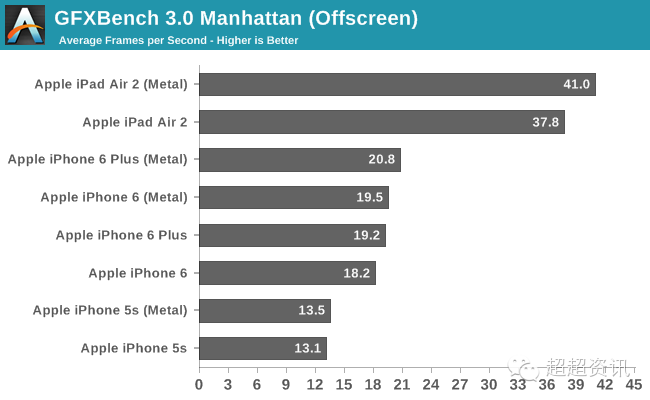
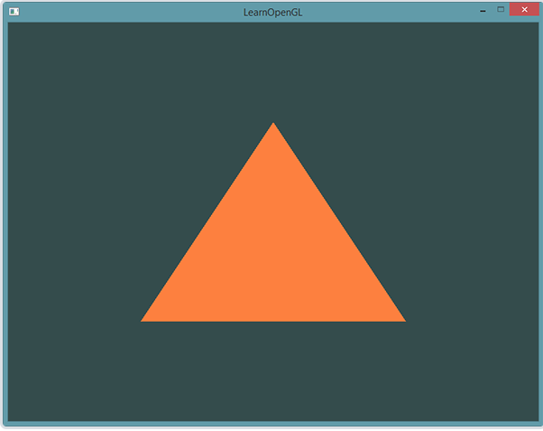
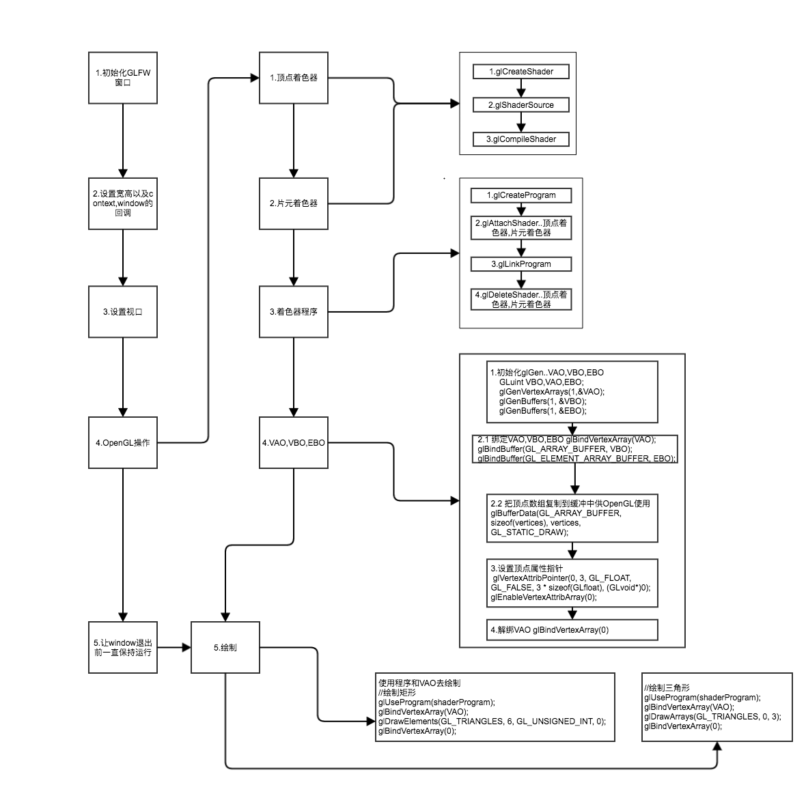
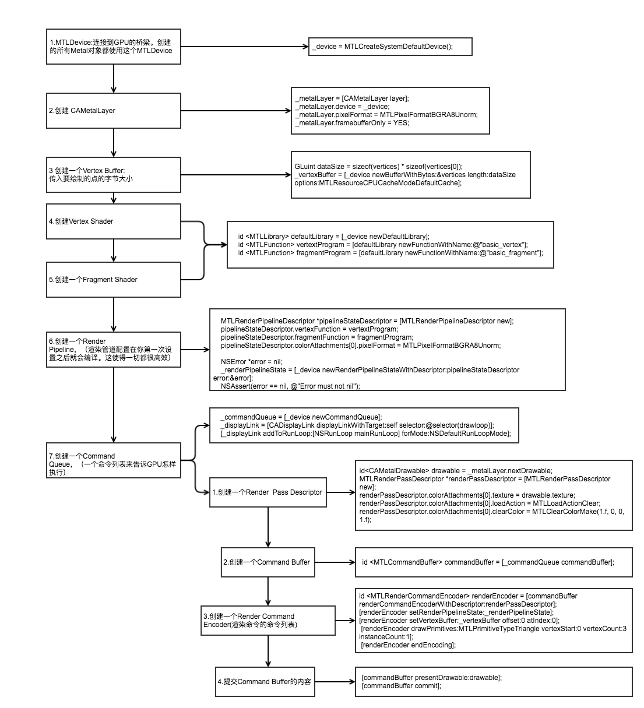

## 一. CPU & GPU

### 1. 概念
1. CPU: 20%运算(Compute)单元 80%逻辑(Logic)单元  
2. GPU: 100%运算单元  
所以GPU的图形图像处理比CPU要快

### 2. 任务处理原理
  

### 3.单核多任务
单核CPU，也可以执行多任务。由于CPU执行代码都是顺序执行的，那么，单核CPU是怎么执行多任务的呢？

答案就是操作系统轮流让各个任务交替执行，任务1执行0.01秒，切换到任务2，任务2执行0.01秒，再切换到任务3，执行0.01秒……这样反复执行下去。表面上看，每个任务都是交替执行的，但是，由于CPU的执行速度实在是太快了，我们感觉就像所有任务都在同时执行一样。

## 二. Metal与OpenGL

|   | Metal  | OpenGL |
|:------------- |:---------------:| -------------:|
| 跨平台 | 是 |  否 |
| 更快的速度与开销 | 是 | 否 |

#### Metal优点
它是一个GPU上一个简单的封装，所以能够完成几乎所有事情，像在屏幕上渲染一个精灵（sprite）或者是一个3D模型。但你要编写完成这些事情的所有代码。这样麻烦的代价是，你拥有了GPU的力量和控制。    
优点：   
1、使硬件达到运行效率的峰值：因为Metal非常底层，它允许你使硬件达到运行效率的峰值，对你的游戏如何运行有着完全的控制。    
2、这是一个很好的学习经历：学习Metal教导你很多关于3D绘图编程的概念，编写你自己的游戏引擎，以及高层(higher level)游戏框架如何运作。

#### 图形测试工具GFXBench的测评
   
各款设备也都有提升，但幅度并不大，最好的iPad Air 2两个项目也分别只高了8.5％、11％。你应该明白，硬件实力摆在那里，Metal只是进一步挖掘释放潜力而已，并不是什么"春药".   

####结论: Metal!=春药
**Metal的真正目的是在移动设备上实现前所未有的画面逼真度**，比如说Epic Games Zen Garden，iPad上以1440×1080分辨率、4xMSAA抗锯齿运行，可以同时展示3500个活动的蝴蝶，平均每帧有4000个绘制调用，这可是OpenGL ES做不到的  

## 三. 回顾OpenGL绘制三角形
   
   
  

## 四. Metal绘制三角形
Metal应用不能跑在iOS模拟器上，它们需要一个设备，设备上装载着苹果A7芯片或者更新的芯片    
MetalDevice:Connect GPUDriver and GPUhardware directly   

### 扩展思考：绘制矩形？

## 参考链接
1.[http://metalbyexample.com/up-and-running-1/](http://metalbyexample.com/up-and-running-1/).  
2.[Metal入门（使用Metal画一个三角形）](http://www.jianshu.com/p/5ce9f4f11637).   
3.[苹果新Metal API实测：四倍完爆OpenGL ES](https://sanwen8.cn/p/59fLGeU.html)